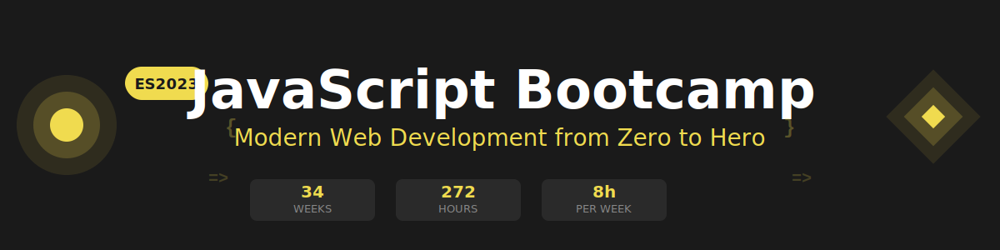

<p align="center">
  
</p>

<p align="center">
  <a href="https://github.com/ergrato-dev/bc-javascript-es2023-cf/blob/main/LICENSE"></a>
  <a href="#"></a>
  <a href="#"></a>
  <a href="#"></a>
</p>

<p align="center">
  <a href="README.md"></a>
</p>

---

## 📋 Description

Intensive **28-week (7-month)** bootcamp focused on mastering modern JavaScript (ES2023). Designed to take students from zero to JavaScript Junior Developer, with emphasis on clean code, best practices, and real-world projects.

### 🎯 Objectives

Upon completion of the bootcamp, students will be able to:

- ✅ Master modern JavaScript features (ES2023)
- ✅ Work with asynchronous programming (Promises, async/await)
- ✅ Effectively manipulate the DOM and handle events
- ✅ Consume and work with REST APIs using Fetch API
- ✅ Apply functional programming and modern patterns
- ✅ Write automated tests with Jest
- ✅ Implement clean code and best practices
- ✅ Build complete and complex applications with pure JavaScript

### 🚀 Why Modern JavaScript?

> **Modern JavaScript from day 1** - No pre-ES2023 history, only current best practices.

This bootcamp focuses exclusively on JavaScript ES2023 and modern features. We don't waste time on outdated syntax or obsolete patterns. Students learn directly the tools and techniques they'll use in the professional world.

---

## 🗓️ Bootcamp Structure

|          Stage          | Weeks | Hours | Main Topics                          |
| :---------------------: | :---: | :---: | ------------------------------------ |
| **Modern Fundamentals** | 1-12  |  96h  | ES2023, Modules, Modern Arrays/Objects |
|    **Intermediate**     | 13-24 |  96h  | Async, Fetch API, DOM, Storage       |
|      **Advanced**       | 25-28 |  32h  | Testing, Patterns, Clean Code        |

**Total: 28 weeks** | **224 hours** of intensive training

---

## 📚 Weekly Content

Each week includes:

```
bootcamp/week-XX/
├── README.md                 # Description and objectives
├── rubrica-evaluacion.md     # Evaluation criteria
├── 0-assets/                 # Images and diagrams
├── 1-teoria/                 # Theoretical material
├── 2-practicas/              # Guided exercises
├── 3-proyecto/               # Weekly project
├── 4-recursos/               # Additional resources
│   ├── ebooks-free/
│   ├── videografia/
│   └── webgrafia/
└── 5-glosario/               # Key terms
```

### 🔑 Key Components

- 📖 **Theory**: Fundamental concepts with real-world examples
- 💻 **Practice**: Progressive exercises and hands-on projects
- 📝 **Assessment**: Evidence of knowledge, performance, and product
- 🎓 **Resources**: Glossaries, references, and complementary material

---

## 🛠️ Tech Stack

| Technology  | Version        | Use                      |
| ----------- | -------------- | ------------------------ |
| JavaScript  | ES2023 | Main language            |
| Jest        | 29+            | Testing and TDD          |
| ESLint      | 8+             | Linting and code quality |
| Prettier    | 3+             | Code formatting          |
| Live Server | -              | Local development        |
| Git         | 2.30+          | Version control          |

**Package managers**: `pnpm` or `yarn` (❌ DO NOT use npm)

---

## 🚀 Quick Start

### Prerequisites

- **Node.js** 24 LTS (recommended for development tools)
- **Git** for version control
- **VS Code** (recommended) with included extensions
- Modern browser (Chrome, Firefox, Edge)

### 1. Clone the Repository

```bash
git clone https://github.com/ergrato-dev/bc-javascript-es2023.git
cd bc-javascript-es2023
```

### 2. Install VS Code Extensions

```bash
# Open in VS Code
code .

# Recommended extensions will appear automatically
# Or run: Ctrl+Shift+P → "Extensions: Show Recommended Extensions"
```

### 3. Navigate to Current Week

```bash
cd bootcamp/week-01
```

### 4. Follow Instructions

Each week contains a `README.md` with detailed instructions.

---

## 📊 Learning Methodology

### Teaching Strategies

- 🎯 **Project-Based Learning (PBL)**
- 🧩 **Deliberate Practice**
- 🔄 **Coding Challenges**
- 👥 **Peer Code Review**
- 🎮 **Live Coding**

### Time Distribution (8h/week)

- **Theory**: 2-2.5 hours
- **Practice**: 3-3.5 hours
- **Project**: 2-2.5 hours

### Assessment

Each week includes three types of evidence:

1. **Knowledge 🧠** (30%): Quizzes and theoretical assessments
2. **Performance 💪** (40%): Practical in-class exercises
3. **Product 📦** (30%): Deliverable assessments (functional projects)

**Passing criteria**: Minimum 70% in each type of evidence

---

## 🤝 Educational Forks

This content is distributed under **CC BY-NC-SA 4.0**: you can use, adapt, and redistribute it freely for educational purposes, as long as you:

- Give appropriate credit to the original author
- Do not use it for commercial purposes
- Share any derivative work under the same license

To report errors or suggestions: [GitHub Issues](https://github.com/ergrato-dev/bc-javascript-es2023-cf/issues)

---

## 📞 Support

- 📧 Email: [your-email@example.com](mailto:your-email@example.com)
- 💬 Discussions: [GitHub Discussions](https://github.com/ergrato-dev/bc-javascript-es2023/discussions)
- 🐛 Issues: [GitHub Issues](https://github.com/ergrato-dev/bc-javascript-es2023/issues)

---

## 📄 License

This project is under the **Creative Commons Attribution-NonCommercial-ShareAlike 4.0 International (CC BY-NC-SA 4.0)** license — see the [LICENSE](LICENSE) file for details.

[](https://creativecommons.org/licenses/by-nc-sa/4.0/)

---

## 🏆 Acknowledgments

- [MDN Web Docs](https://developer.mozilla.org/) - For the best JavaScript documentation
- [JavaScript.info](https://javascript.info/) - For excellent tutorials
- [TC39](https://tc39.es/) - For evolving JavaScript
- JavaScript Community - For resources and examples
- All contributors

---

## 📚 Additional Documentation

- [🤖 Copilot Instructions](.github/copilot-instructions.md)
- [📖 Study Plan](_docs/plan-estudios.md)
- [📋 Content Development Guide](_docs/guia-desarrollo-contenidos.md)

---

## ⚠️ Disclaimer

This repository and all its contents are provided **"as is"** for **educational purposes only**.

- The material in this bootcamp is for instructional use. The author and contributors **make no guarantees** of specific learning outcomes, employment, or professional performance resulting from the use of this content.
- The code examples included are for teaching purposes. **They should not be used directly in production environments** without proper review and adaptation.
- References to tools, libraries, external services, or third-party resources are included as guidance only. The author **is not responsible** for changes, outages, or the content of such external resources.
- The author **assumes no liability** for direct, indirect, incidental, or consequential damages arising from the use of or inability to use this material.
- Use of this repository implies acceptance of the terms of the [CC BY-NC-SA 4.0 License](LICENSE) under which it is distributed.

> This project is independent and **is not affiliated with, sponsored by, or endorsed by** any technology company mentioned in the content (Mozilla, Google, Microsoft, etc.).

---

<p align="center">
  <strong>🎓 Modern JavaScript Bootcamp (ES2023)</strong><br>
  <em>From zero to JavaScript Junior Developer in 7 months</em>
</p>

<p align="center">
  <a href="bootcamp/week-01-que-es-programar">Start Week 1</a> •
  <a href="_docs">View Documentation</a> •
  <a href="../../issues">Report Issue</a>
</p>

<p align="center">
  Made with ❤️ for the developer community
</p>
